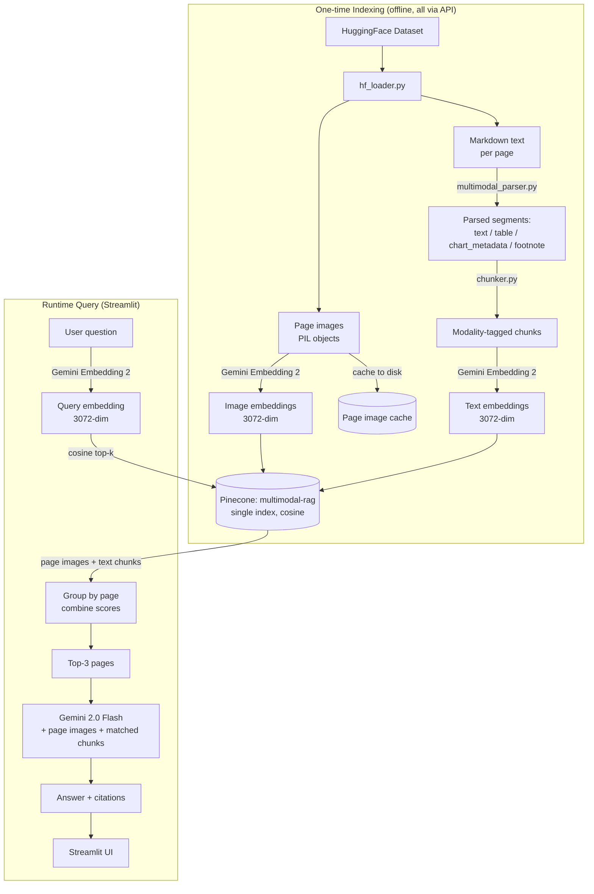
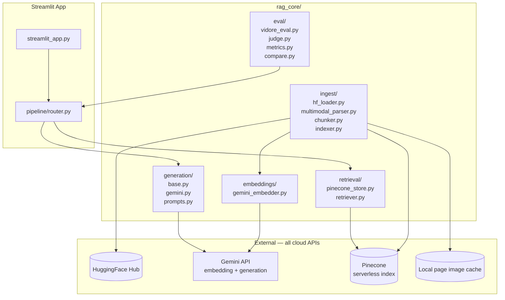

# DSAI 413 — Assignment 1
## Multi-Modal Document Intelligence (RAG-Based QA System) — System Design Document

**Author:** Megamind
**Scope:** Solo, ~7 days
**Hardware:** MacBook Air M1 (8 GB unified memory)
**Deliverables:** Codebase (GitHub), Streamlit demo, 2-page technical report, 2–5 min video
**Dataset:** `vidore/vidore_v3_finance_en` (ViDoRe V3 Finance benchmark, HuggingFace)

---

## 1. Problem Framing

The assignment asks for a multi-modal RAG system that answers questions over visually rich financial documents where critical information lives in text, tables, charts, figures, footnotes, and layout.

**Our approach:** Use **Gemini Embedding 2** (Google, March 2026) — the first natively multimodal embedding model that maps text, images, and documents into a **single unified embedding space**. We embed both parsed text chunks AND rendered page images into one Pinecone index, enabling true cross-modal retrieval where a text query finds both relevant text passages and relevant page images via cosine similarity in one search.

This directly satisfies the rubric's "Vector index: Unified multi-modal embedding space" requirement — by construction, not as a workaround.

### 1.1 Why Gemini Embedding 2?

- **Natively multimodal:** One model embeds text, images, and PDFs into one vector space. No separate encoders.
- **Zero local compute:** Runs entirely via API. On an 8 GB M1, zero VRAM pressure.
- **Free tier:** Available via Gemini API with generous rate limits.
- **Brand new (March 2026):** No classmate will have used this. Strong "Innovation" score.
- **3072 dimensions:** Full-quality output. Matryoshka (MRL) allows reduction to 1536 or 768 if needed.
- **Same SDK as generation:** `google-genai` handles both embedding and Gemini Flash.

### 1.2 Why Pinecone?

- **Managed cloud vector database:** No Docker, no local storage, no embedded mode to configure.
- **Free tier (Starter):** 2 GB storage — our ~13K records at 3072-dim ≈ ~160 MB, well within limits.
- **Serverless:** Scales automatically. Zero infrastructure management.
- **Native cosine similarity:** First-class support for the similarity metric Gemini Embedding 2 uses.
- **Metadata filtering:** Filter by `record_type` and `modality` at search time — no post-filter hack needed.
- **Persistent index:** Grader can run the demo against the existing cloud index without re-indexing.

### 1.3 Constraints

| Constraint | Implication |
|---|---|
| 8 GB M1 | Zero local model inference. All embedding, retrieval, and generation via API. |
| 1 week solo | Pre-collected benchmark dataset. Simple all-API stack. |
| 25% Accuracy & Faithfulness | 309 human-verified queries with ground-truth answers. |
| 20% Multi-modal Coverage | Explicit multi-modal parser. Page images + text chunks in unified space. Per-content_type eval. |
| 20% System Design | Clean pipeline: ingest → parse → chunk → embed → index → retrieve → generate → eval. |
| 15% Innovation | Gemini Embedding 2 (March 2026) + Pinecone serverless + unified multimodal retrieval. |

### 1.4 Non-functional requirements

- **Latency:** Indexing offline (~30–60 min via API). Query: p95 < 5 s (Pinecone serverless is fast).
- **Memory:** Peak RAM < 2 GB (no local models).
- **Reproducibility:** Dataset on HuggingFace. Pinecone index persists in cloud. Two API keys.
- **Cost:** Free tiers for both Gemini and Pinecone.

---

## 2. Architectural Decisions

### ADR-01: Gemini Embedding 2 as the sole embedding model

**Context:** The original plan used ColSmol-500M for visual retrieval + a text embedding model — two separate vector spaces.

**Decision:** Use **Gemini Embedding 2** (`gemini-embedding-2-preview`) for everything. Embed both page images and text chunks with the same model into the same 3072-dim vector space.

**Trade-off:** We lose ColPali-style multi-vector late-interaction (MaxSim), which provides fine-grained patch-level matching. We mitigate by also embedding parsed text chunks (tables, chart metadata) alongside page images — text chunks provide the fine-grained matching that single-vector image embedding misses.

### ADR-02: Pinecone serverless as the vector store

**Context:** Options considered: Qdrant (local embedded), FAISS (in-memory), Chroma (local), Pinecone (cloud managed).

**Decision:** **Pinecone serverless** (free Starter tier).

| Option | Hosting | Metadata filter | Multi-modality | Effort |
|---|---|---|---|---|
| Qdrant embedded | Local | Yes | Yes | Moderate (setup) |
| FAISS | In-memory | Manual | Manual | High (no persistence) |
| Chroma | Local | Yes | Limited | Moderate |
| **Pinecone** | Cloud managed | Yes (native) | Same collection | Low (zero infra) |

**Why Pinecone wins:**
- Zero local storage. Index lives in the cloud. Grader runs demo without re-indexing.
- Native metadata filtering: `filter={"record_type": "page_image"}` at search time for the text-only/image-only eval configs.
- Serverless = no capacity planning. Free tier = no cost.

### ADR-03: Single Pinecone index with unified multimodal vectors

One Pinecone index: `multimodal-rag`
- Dimension: **3072** (Gemini Embedding 2 full output, highest quality)
- Metric: **cosine**
- Contains BOTH page-image embeddings AND text-chunk embeddings
- Metadata fields: `record_type`, `corpus_id`, `doc_id`, `page_number`, `modality`, `chunk_text`, `image_path`

At query time, one search returns both relevant page images AND text chunks. Group by `corpus_id` → top-k pages → VLM generator.

### ADR-04: Gemini 2.0 Flash for generation

Same vendor. Accepts images natively. Free tier.

### ADR-05: Streamlit for the demo

### ADR-06: ViDoRe V3 Finance dataset

2,942 pages, 309 queries, 8,766 qrels. CC BY 4.0.

---

## 3. System Architecture

### 3.1 High-level flow



### 3.2 Component breakdown



### 3.3 Data model

Every record in the single Pinecone index `multimodal-rag`:

```python
{
    "id": "img_00042",                   # or "tc_00042_003" for text chunks
    "values": [0.012, -0.034, ...],      # 3072-dim (Gemini Embedding 2, full quality)
    "metadata": {
        "corpus_id": 42,
        "doc_id": "fin_report_003",
        "page_number": 12,
        "record_type": "page_image",     # "page_image" | "text_chunk"
        "modality": "",                  # "" for images; "text"|"table"|"chart_metadata"|"footnote"
        "chunk_text": "",                # "" for images; chunk content for text
        "image_path": "data/pages/00042.png"
    }
}
```

Pinecone metadata filtering enables the three eval configs:
- `text_only` → `filter={"record_type": "text_chunk"}`
- `image_only` → `filter={"record_type": "page_image"}`
- `unified` → no filter (search all records)

---

## 4. Multi-Modal Ingestion Pipeline

### 4.1 Dataset loading

```python
from datasets import load_dataset

DS = "vidore/vidore_v3_finance_en"
corpus     = load_dataset(DS, data_dir="corpus",              split="test")
queries    = load_dataset(DS, data_dir="queries",             split="test")
qrels      = load_dataset(DS, data_dir="qrels",              split="test")
doc_meta   = load_dataset(DS, data_dir="documents_metadata",  split="test")
```

### 4.2 Multi-modal parsing (`multimodal_parser.py`)

**Text segments:** Paragraphs of prose. Split on double newlines and headings. Tagged `modality="text"`.

**Table segments:** Markdown table blocks (lines with `|` and `---` separators). Preserve whole — never split mid-row. Keep `|` and `-` delimiters intact. Tagged `modality="table"`.

**Chart/figure metadata extraction:** Detect `Figure X`, `Chart X`, `Graph X`, image alt-text, captions. Extract chart metadata: captions, references, page placement context. Tagged `modality="chart_metadata"`.

**Footnote segments:** Detect superscript refs (`¹²³`, `[1]`, `1/`, `*`) and their text. Append to parent paragraph when resolvable, else standalone. Tagged `modality="footnote"`.

### 4.3 Smart chunking (`chunker.py`)

| Modality | Strategy | Chunk size | Overlap |
|---|---|---|---|
| `text` | Split by paragraph/sentence boundaries | ~200 tokens | 50 tokens |
| `table` | Whole table, never split rows, keep markdown formatting | Varies | 0 |
| `chart_metadata` | Caption + surrounding paragraph | ~100–150 tokens | 0 |
| `footnote` | Append to parent chunk or standalone | ~50–100 tokens | 0 |

### 4.4 Embedding with Gemini Embedding 2

```python
from google import genai
from google.genai import types

client = genai.Client()

# Embed a text chunk → 3072-dim vector
text_result = client.models.embed_content(
    model="gemini-embedding-2-preview",
    contents=["Revenue increased by 15% year-over-year..."],
    config=types.EmbedContentConfig(output_dimensionality=3072)
)

# Embed a page image → 3072-dim vector (same space!)
with open("data/pages/00042.png", "rb") as f:
    image_bytes = f.read()
image_result = client.models.embed_content(
    model="gemini-embedding-2-preview",
    contents=[types.Part.from_bytes(data=image_bytes, mime_type="image/png")],
    config=types.EmbedContentConfig(output_dimensionality=3072)
)
```

### 4.5 Indexing into Pinecone

```python
from pinecone import Pinecone

pc = Pinecone(api_key=PINECONE_API_KEY)
index = pc.Index("multimodal-rag")

# Upsert page image embeddings
index.upsert(vectors=[
    {
        "id": f"img_{corpus_id:05d}",
        "values": image_embedding,
        "metadata": {
            "corpus_id": corpus_id,
            "record_type": "page_image",
            "doc_id": doc_id,
            "page_number": page_number,
            "modality": "",
            "image_path": f"data/pages/{corpus_id:05d}.png"
        }
    }
])

# Upsert text chunk embeddings
index.upsert(vectors=[
    {
        "id": f"tc_{corpus_id:05d}_{chunk_idx:03d}",
        "values": chunk_embedding,
        "metadata": {
            "corpus_id": corpus_id,
            "record_type": "text_chunk",
            "modality": "table",
            "chunk_text": chunk_text,
            "doc_id": doc_id,
            "page_number": page_number
        }
    }
])
```

**Rate limiting:** Batch upserts in groups of 100 vectors. Batch embedding calls in groups of 10. Sleep 1s between embedding batches. Cache all embeddings to `data/embeddings/` as numpy arrays for resume.

---

## 5. Retrieval & Generation Pipeline

### 5.1 Retrieval (`retriever.py`)

```
1. Embed query with Gemini Embedding 2 (3072-dim)
2. Search Pinecone index (cosine, top_k=20)
   - For unified system: no filter
   - For text_only eval: filter={"record_type": "text_chunk"}
   - For image_only eval: filter={"record_type": "page_image"}
3. Results contain both page_image and text_chunk records
4. Group by corpus_id (page):
   combined_score = max(all scores for this page)
5. Rank pages by combined_score
6. Return top-3 pages with matched text chunks
```

### 5.2 Generation

Send top-3 page images + matched text chunks to Gemini 2.0 Flash:

```
You are answering a question about financial document pages.
The pages are shown as images. Relevant text extracts are also provided.

Extracted text chunks:
{matched_chunks_with_modality_tags}

Rules:
1. Answer ONLY from what is visible in the images and text chunks.
2. If the answer is not present, say "The retrieved pages do not contain this information."
3. For numeric answers, quote the exact number and its row/column context.
4. End with "Sources: [page IDs used]"

Question: {question}
```

### 5.3 Citation validation + bounding box overlay

Validate cited pages ⊆ retrieved pages. Overlay `bounding_boxes` from qrels on page thumbnails.

---

## 6. Evaluation Suite

### 6.1 Three systems compared

| System | Pinecone filter | Tests |
|---|---|---|
| **Text-only** | `{"record_type": "text_chunk"}` | Where text retrieval suffices |
| **Image-only** | `{"record_type": "page_image"}` | Where visual retrieval suffices |
| **Unified** | No filter (all records) | Full system — expected winner |

### 6.2 Metrics

- Recall@1, Recall@5, MRR@10, nDCG@5 (via pytrec_eval)
- Per-content_type breakdown (from qrels)
- LLM-as-judge faithfulness (Gemini Flash)
- Citation validity rate

### 6.3 Execution

```bash
uv run python -m rag_core.eval.run --system text_only   --out results/run1.json
uv run python -m rag_core.eval.run --system image_only   --out results/run2.json
uv run python -m rag_core.eval.run --system unified      --out results/run3.json
uv run python -m rag_core.eval.compare results/*.json --md > eval_report.md
```

---

## 7. Repository Structure

```
dsai413-multimodal-rag/
├── README.md
├── Makefile                     # make index, make demo, make eval
├── pyproject.toml
├── .env.example                 # GEMINI_API_KEY, PINECONE_API_KEY
├── data/
│   ├── pages/                   # cached page PNGs (gitignored)
│   └── embeddings/              # cached embedding vectors (gitignored)
├── rag_core/
│   ├── ingest/
│   │   ├── hf_loader.py         # load_dataset wrapper + page caching
│   │   ├── multimodal_parser.py # text / table / chart_metadata / footnote extraction
│   │   ├── chunker.py           # modality-aware smart chunking
│   │   └── indexer.py           # end-to-end: load → parse → chunk → embed → upsert
│   ├── embeddings/
│   │   └── gemini_embedder.py   # Gemini Embedding 2 wrapper (text + images)
│   ├── retrieval/
│   │   ├── pinecone_store.py    # Pinecone index management
│   │   └── retriever.py         # search + group by page + rank
│   ├── generation/
│   │   ├── base.py              # abstract Generator ABC
│   │   ├── gemini.py            # Gemini 2.0 Flash
│   │   └── prompts.py           # generation + citation prompts
│   ├── pipeline/
│   │   └── router.py            # end-to-end orchestration
│   └── eval/
│       ├── vidore_eval.py       # benchmark runner
│       ├── metrics.py           # Recall, MRR, nDCG, per-content_type
│       ├── judge.py             # LLM-as-judge (Gemini Flash)
│       └── compare.py           # multi-system comparison
├── app/
│   └── streamlit_app.py
├── report/
│   └── technical_report.md
└── tests/
    ├── test_smoke.py
    ├── test_parser.py
    ├── test_chunker.py
    ├── test_embedder.py
    ├── test_retriever.py
    ├── test_router.py
    └── test_metrics.py
```

---

## 8. Seven-Day Plan

| Day | Deliverables | Risk |
|---|---|---|
| **Day 1** | Env setup. `hf_loader.py`. `multimodal_parser.py` + `chunker.py`. Test parser on 50 pages. | Markdown format varies. |
| **Day 2** | `gemini_embedder.py`. Create Pinecone index (3072-dim, cosine). `pinecone_store.py`. `indexer.py`. Full indexing run. | API rate limits — batch + sleep + cache. |
| **Day 3** | `retriever.py`. `generation/`. `pipeline/router.py`. Streamlit UI. | Gemini rate limits. |
| **Day 4** | Eval suite. Run all 3 systems (50-query subset first). | Judge cost. |
| **Day 5** | Debug. Add bbox overlays. Full eval runs. | — |
| **Day 6** | Technical report. Video. README. Push to GitHub. | Video re-takes. |
| **Day 7** | Buffer. Polish. Submit. | — |

**Non-negotiables:** eval suite, 3-system comparison, multi-modal parser, video.

---

## 9. Risk Register

| Risk | Likelihood | Impact | Mitigation |
|---|---|---|---|
| Gemini Embedding 2 rate limits | Medium | High | Batch size 10, sleep 1s. Cache to disk. Resume from cache. |
| Pinecone free tier storage limit | Very Low | Low | ~160 MB needed, 2 GB available. |
| Image embedding quality for charts | Medium | Medium | Text chunks with chart_metadata provide backup. Eval shows where each helps. |
| Pinecone serverless cold start latency | Low | Low | First query may be slow (~2s). Subsequent queries are fast. |
| Gemini Embedding 2 preview changes | Low | Medium | Pin model string `gemini-embedding-2-preview`. Cache embeddings locally. |

---

## 10. Video Script

1. **Problem** (20 s) — "Financial docs have charts, tables, footnotes. Text-only RAG misses half the signal."
2. **Solution** (40 s) — "Gemini Embedding 2 — one model puts text AND images in one unified vector space. Pinecone serverless stores everything in one index."
3. **Multi-modal ingestion** (30 s) — "We parse text, extract tables whole, detect chart metadata, handle footnotes — then embed everything alongside full page images."
4. **Demo** (90 s) — Three questions: text, table, chart. Show retrieved pages with bounding boxes.
5. **Eval** (45 s) — Three-system comparison table. Per-content_type breakdown.
6. **Limitations** (15 s) — Single-vector may miss fine-grained table cells. Preview model may change.

---

## 11. Rubric Coverage

| Rubric item | Weight | How addressed |
|---|---|---|
| **Accuracy & Faithfulness** | 25% | 309 queries + ground truth + LLM-as-judge + citation validation |
| **Multi-modal Coverage** | 20% | `multimodal_parser.py` handles text, tables, chart metadata, footnotes. Page images + text chunks in unified space. Per-content_type eval. |
| **System Design** | 20% | Clean all-API pipeline. Single Pinecone index with unified multimodal embeddings. Metadata filtering for eval configs. |
| **Innovation & Tooling** | 15% | Gemini Embedding 2 (March 2026). Pinecone serverless. Unified multimodal RAG. ViDoRe V3 Finance. |
| **Code Quality** | 10% | Modular repo. ABC patterns. Type hints. Tests per module. |
| **Presentation & Report** | 10% | 2-page report + 3-system eval table + video with live demo. |

---

## Appendix A — Dependencies

```toml
[project]
requires-python = ">=3.11"
dependencies = [
  "google-genai>=1.0",            # Gemini Embedding 2 + Gemini Flash
  "pinecone>=5.0",                 # Pinecone serverless
  "datasets>=3.0",                 # HuggingFace datasets
  "pillow>=10",
  "streamlit>=1.38",
  "python-dotenv>=1.0",
  "pytrec-eval-terrier>=0.5",
]
```

No torch. No transformers. Seven dependencies. Two API keys.

## Appendix B — Pinecone Index Setup (one-time)

```python
from pinecone import Pinecone, ServerlessSpec

pc = Pinecone(api_key=PINECONE_API_KEY)
pc.create_index(
    name="multimodal-rag",
    dimension=3072,
    metric="cosine",
    spec=ServerlessSpec(cloud="aws", region="us-east-1")
)
```

## Appendix C — References

- Google, *Gemini Embedding 2: Our first natively multimodal embedding model*, blog.google, March 2026.
- Loison et al., *ViDoRe V3*, arXiv:2601.08620 (2026).
- `vidore/vidore_v3_finance_en` — HuggingFace dataset card.
- Faysse et al., *ColPali*, arXiv:2407.01449 (referenced for context on visual retrieval).
